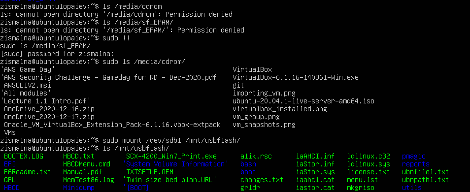
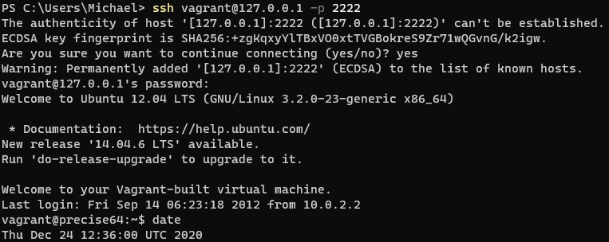
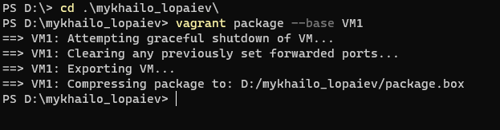

# Hypervisors
### Most popular hypervisors

The list of the most popular hypervisors for infrastructure virtualization includes as follows:

- VMware vSphere Hypervisor
- Microsoft Hyper-V
- Citrix XenServer
- Oracle VirtualBox
- Red Hat Enterprise Virtualization Hypervisor (REVH)
- Qemu-KVM

Main differences between hypervisors are:

- Licensing and ownership (open-source, proprietary; which company or community supports and develops the product in question)
- Different configuration options (max RAM, VM disk capacity, number of CPUs)


# Work with VirtualBox

### Setting up VirtualBox and VMs

First, I installed VirtualBox:


Installed Ubuntu Server, acquainted myself with possibilities of VM control:


Cloned existing VM into VM2, and joined them into group:


Explored group control options.

Took several snapshots: the root one after the fresh Ubuntu Server installation, then branched it into the version where I installed updates via apt and installed *awscli* package, and the version where I did not install updates, and instead simply installed *glances* package. Named the snapshots respectively:


Exported VM1 into and *.ova* file, importing it as VM3:


Configured resource sharing between host and guest; installed Guest Additions on Ubuntu guest first:

```sh
cd /media/cdrom
sudo apt-get install -y dkms build-essential linux-headers-generic linux-headers-$(uname -r)
sudo ./VBoxLinuxAdditions.run
```

Shared the USB drive and local folder:


The resources are correctly mapped onto guest, the shared folder is mounted on */media/cdrom*, and I mounted USB partition on */mnt/usbflash*:

 

Tried several networking modes and read about networking in VirtualBox:

<table>
<thead>
  <tr>
    <th colspan="7">Reachable<br></th>
  </tr>
</thead>
<tbody>
  <tr>
    <td rowspan="6"><br>Mode<br></td>
    <td></td>
    <td>VM to host</td>
    <td>host to VM</td>
    <td>VM1 to VM2</td>
    <td>VM to Internet</td>
    <td>Internet to VM</td>
  </tr>
  <tr>
    <td>NAT</td>
    <td>yes</td>
    <td>via port forwarding<br></td>
    <td>no</td>
    <td>yes<br></td>
    <td>via port forwarding</td>
  </tr>
  <tr>
    <td>Bridged</td>
    <td>yes</td>
    <td>yes</td>
    <td>yes</td>
    <td>yes</td>
    <td>yes</td>
  </tr>
  <tr>
    <td>Internal</td>
    <td>no</td>
    <td>no</td>
    <td>yes</td>
    <td>no</td>
    <td>no</td>
  </tr>
  <tr>
    <td>Host-only</td>
    <td>yes</td>
    <td>yes</td>
    <td>yes</td>
    <td>no</td>
    <td>no</td>
  </tr>
  <tr>
    <td>NAT Network</td>
    <td>yes</td>
    <td>via port forwarding<br></td>
    <td>yes</td>
    <td>yes<br></td>
    <td>via port forwarding</td>
  </tr>
</tbody>
</table>

Used CLI to mock manage VM1 via VBoxManage.

# Work with Vagrant

Installed Vagrant, initialized and started default Vagrant box:

```sh
mkdir mykhailo_lopaiev
cd .\mykhailo_lopaiev\
init hashicorp/precise64
vagrant up
```

Logged into it via SSH:

 

Stopping and deleting the box:

```sh
vagrant halt
vagrant destroy
```

### Making own Vagrant box

Prepping the VM:

Adding user *vagrant* with password "vagrant" and setting paswordless sudo with vagrant ALL=(ALL) NOPASSWD:ALL
```sh
useradd vagrant
passwd vagrant
visudo /etc/sudoers
```

Installing Vagrant key:

```sh
mkdir -p /home/vagrant/.ssh
chmod 0700 /home/vagrant/.ssh
wget --no-check-certificate https://raw.github.com/mitchellh/vagrant/master/keys/vagrant.pub -O /home/vagrant/.ssh/authorized_keys
chmod 0600 /home/vagrant/.ssh/authorized_keys
chown -R vagrant /home/vagrant/.ssh
```
Packaging the box:
 

Testing the box after it's packaged:

 


