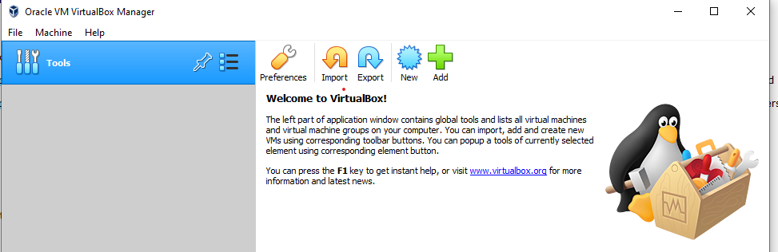

# Hypervisors
### Most popular hypervisors

The list of the most popular hypervisors for infrastructure virtualization includes as follows:

- VMware vSphere Hypervisor
- Microsoft Hyper-V
- Citrix XenServer
- Oracle VirtualBox
- Red Hat Enterprise Virtualization Hypervisor (REVH)
- Qemu-KVM

Main differences between hypervisors are:

- Licensing and ownership (open-source, proprietary; which company or community supports and develops the product in question)
- Different configuration options (max RAM, VM disk capacity, number of CPUs)


# Work with VirtualBox

### Setting up VirtualBox and VMs

First, I installed VirtualBox:



Installed Ubuntu Server, acquainted myself with possibilities of VM control:


Cloned existing VM into VM2, and joined them into group:


Explored group control options.

Took several snapshots: the root one after the fresh Ubuntu Server installation, then branched it into the version where I installed updates via apt and installed *awscli* package, and the version where I did not install updates, and instead simply installed *glances* package. Named the snapshots respectively:


Exported VM1 into and *.ova* file, importing it as VM3:


Configured resource sharing between host and guest; installed Guest Additions on Ubuntu guest first:

```sh
cd /media/cdrom
sudo apt-get install -y dkms build-essential linux-headers-generic linux-headers-$(uname -r)
sudo ./VBoxLinuxAdditions.run
```

Shared the USB drive and local folder:


The resources are correctly mapped onto guest, the shared folder is mounted on /media/cdrom, and I mounted USB partition on /mnt/usbflash:

![Guest] (./images/guest.png "Guest") 

Used CLI to mock manage VM1 via VBoxManage.

# Work with Vagrant


