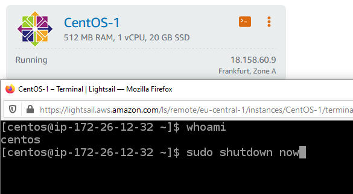
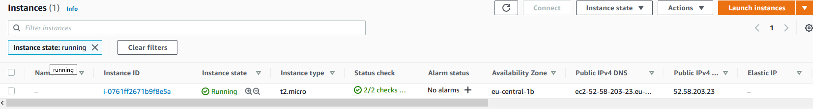
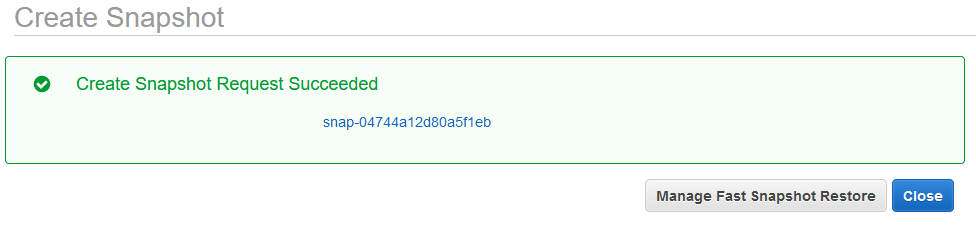
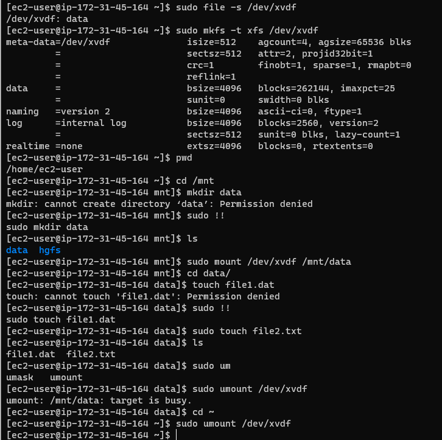
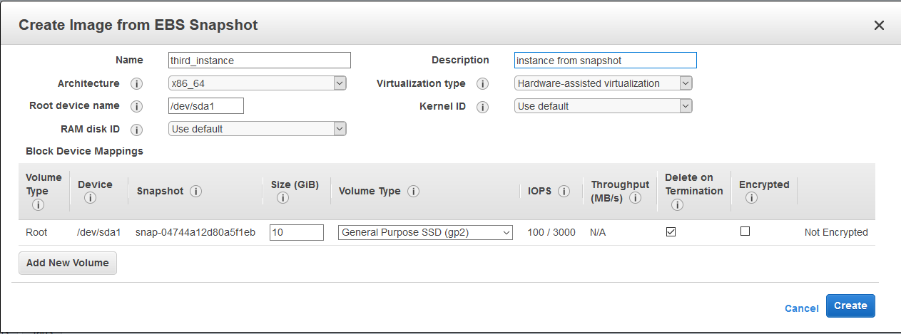
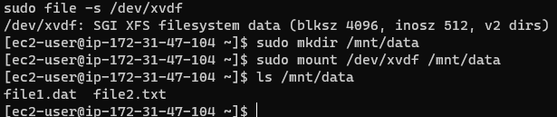

# AWS

Provisioning and instance with Amazon Lightsail and logging into it:

Launching EC2 instance without Amazon Lightsail and taking a snapshot:

Created an EBS volume and atached in to the instance. Mounted on the filesystem and created some files:

Spun up another instance from the snapshot taken earlier:

Attached the volume detached from the last instance and made sure the files are there:

Created an S3 bucket and uploaded my files there.
Hosted a static website available at zismalna.com (redirect).
