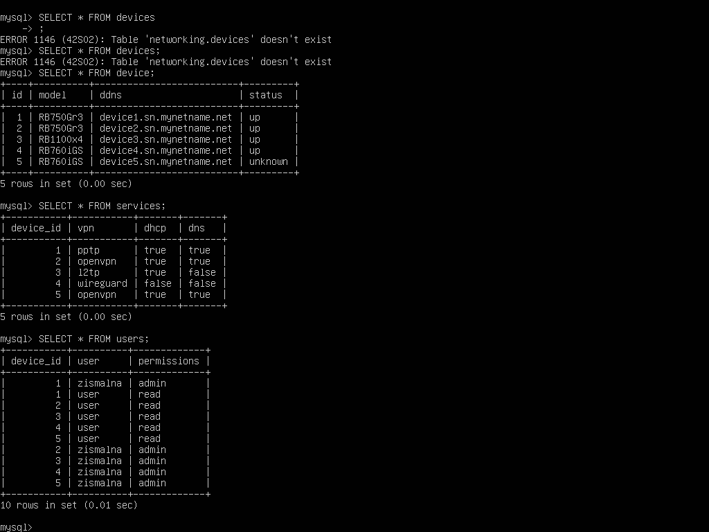
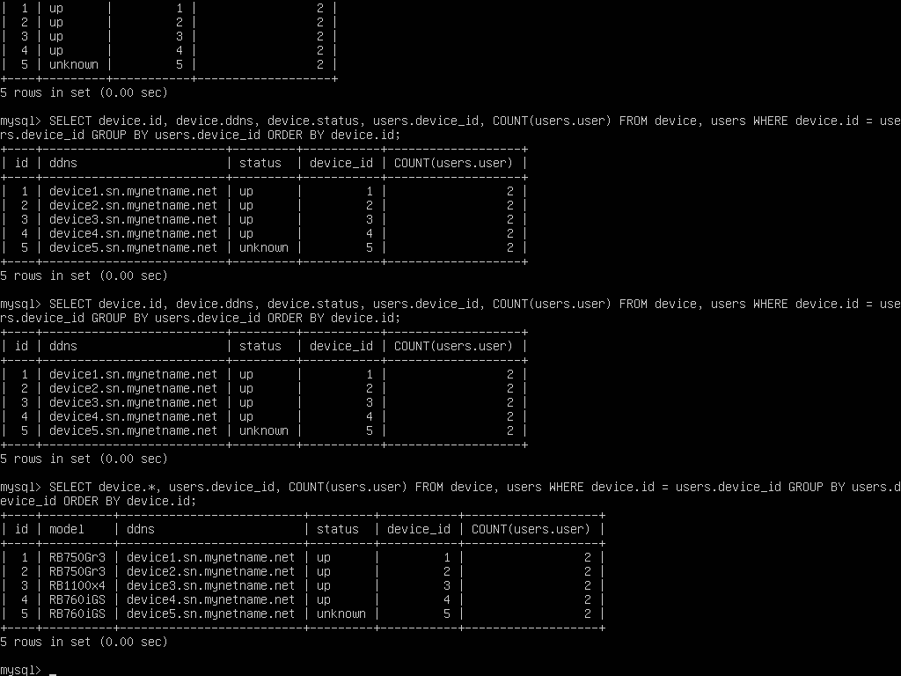
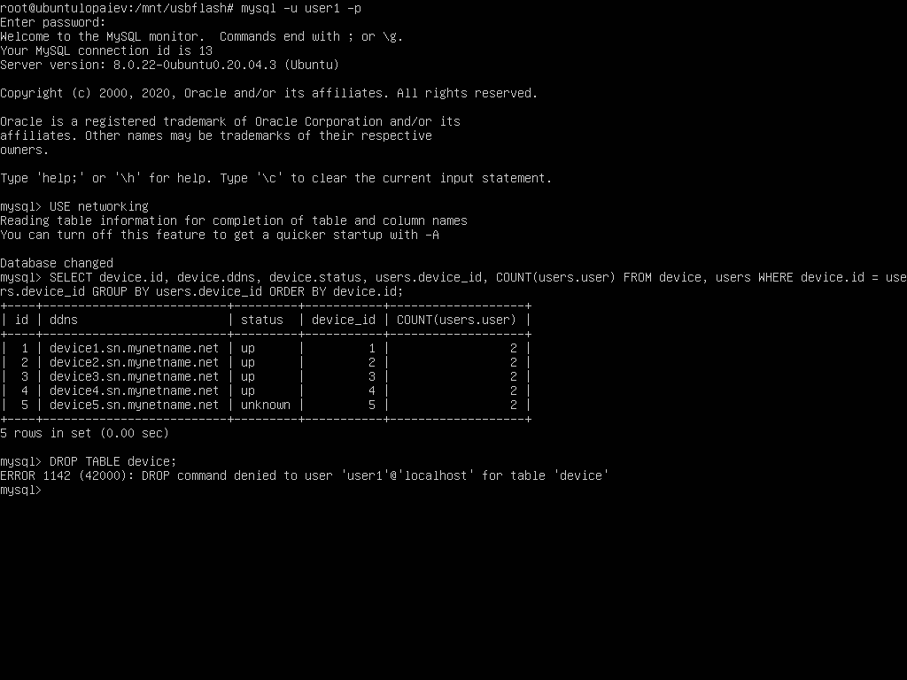
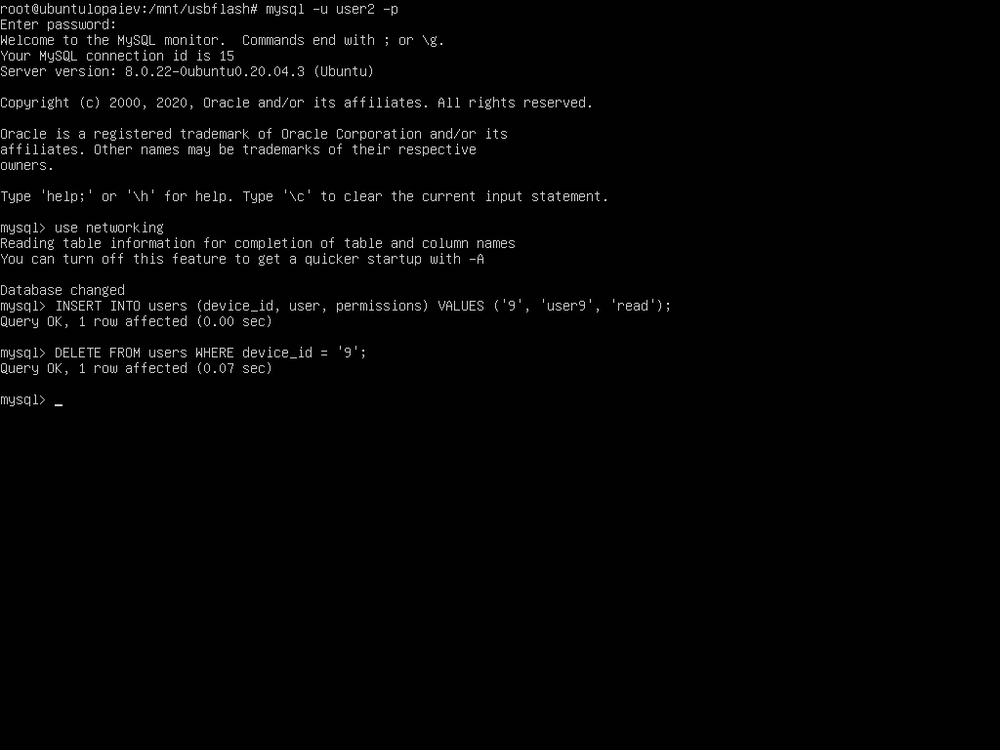
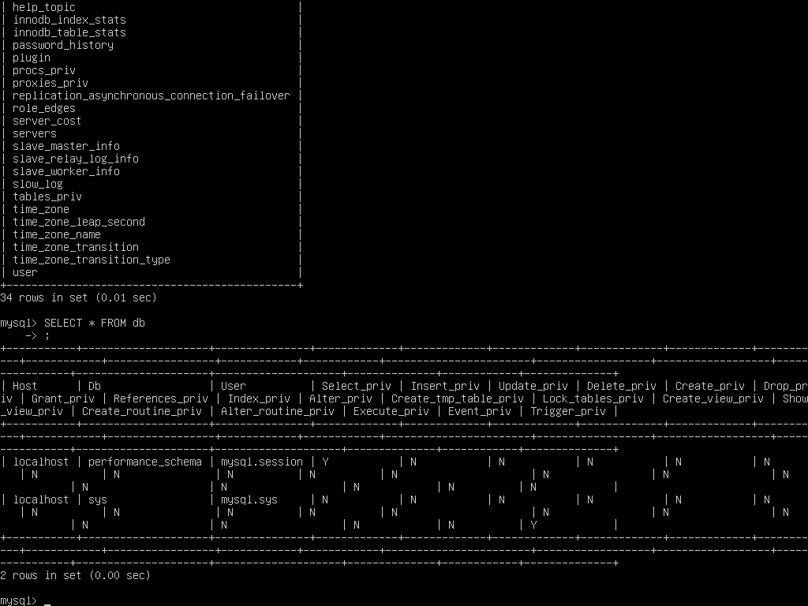
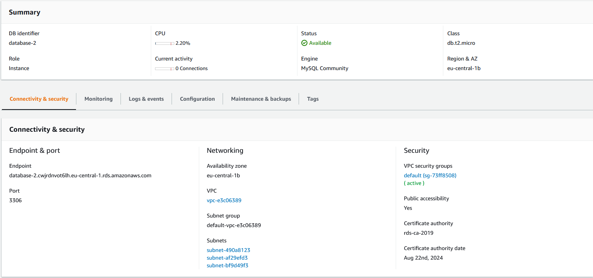
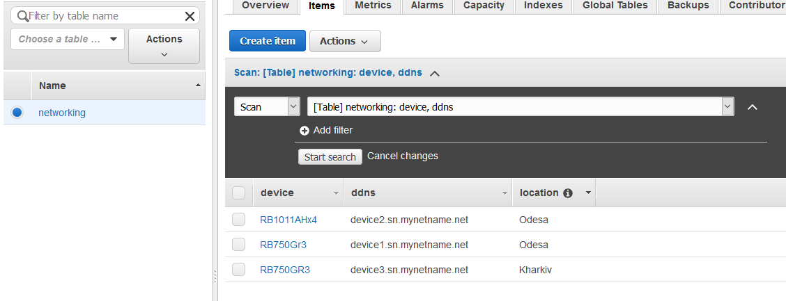
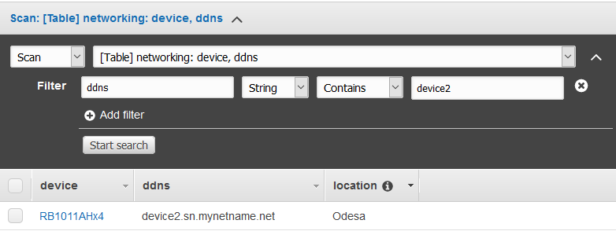
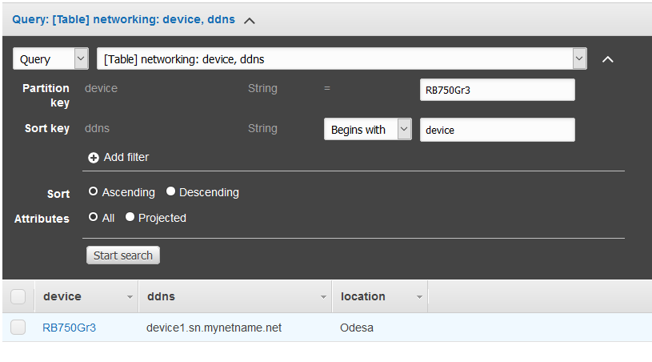

# Database administration
### Part 1 - Local MySQL database

Installed MySQL Server on Ubuntu VM. Created a database with the following schema:

```sh

CREATE TABLE `device` (
  `id` int(9) unsigned NOT NULL AUTO_INCREMENT,
  `model` varchar(255) NOT NULL,
  `ddns` varchar(255) NOT NULL,
  `status` enum('up','down','unknown') NOT NULL,
  KEY `id` (`id`)
) ENGINE=InnoDB DEFAULT CHARSET=utf8;

CREATE TABLE `services` (
  `device_id` int(9) unsigned NOT NULL,
  `vpn` varchar(255) NOT NULL,
  `dhcp` enum('true','false') NOT NULL,
  `dns` set('true','false') NOT NULL
) ENGINE=InnoDB DEFAULT CHARSET=utf8;

CREATE TABLE `users` (
  `device_id` int(9) unsigned NOT NULL,
  `user` varchar(255) NOT NULL,
  `permissions` varchar(255) NOT NULL
) ENGINE=InnoDB DEFAULT CHARSET=utf8;
```

Populated table rows with data using INSERT. The result is as follows:



I used a mock database of MikroTik routers that I manage, listing device models, services, users, etc.

Performed several queries as per task:



Added users with different permissions:

```sh
mysql> CREATE USER user1@localhost IDENTIFIED BY passwd1;
mysql> GRANT SELECT on *.* to user1@localhost;

mysql> CREATE USER user2@localhost IDENTIFIED BY passwd2;
mysql> GRANT SELECT, CREATE, DELETE on *.* to user2@localhost;
```

Testing permissions:




Querying 'db' table of 'mysql' database:



### Part 2

Making backup, deleting a table, and restoring it:

```sh
mysqldump --databases networking > dump1.sql
mysql
USE networking
DROP services;
SHOW tables;
source dump1.sql
SHOW tables;
```

Creating an RDS DB:



Connecting to it, restoring data from dump, making a selection:

```sh
mysql -h database-2.cwjrdnvot6lh.eu-central-1.rds.amazonaws.com -P 3306 -u dbadmin -p
use networking
source dump1.sql
SHOW tables;
SELECT device.id, device.ddns, device.status, users.device_id, COUNT(users.user) FROM device, users WHERE device.id = users.device_id GROUP BY users.device_id ORDER BY device.id;
mysqldump --databases networking > dump2.sql
```

### Part 3 - Amazon DynamoDB

Created DynamoDB table:



Used Scan and Query:






