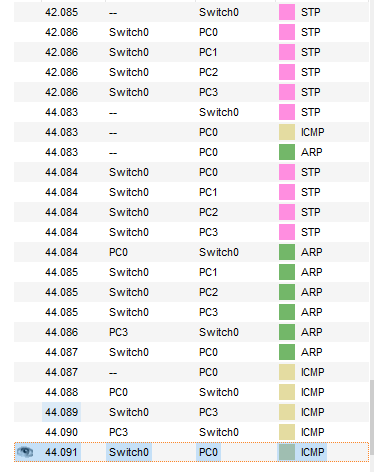

# Networking fundamentals

### Building a small hub network

Built a hub-based network, assigned IP addresses (192.168.0.1-4 MASK 255.255.255.0) to PCs:

Checked the connection using ICMP:

To send IP packet from PC0 to PC3, ARP protocol is used to discover target MAC address:

After the source device knows target device's link layer address, ICMP echo request is sent:

The target device repiles with ICMP echo reply. While the devices that process IP packets de-encapsulate them up to L3 (no higher layers are involved in this task), hub simply retransmits an electric signal, so no layers higher than L1 are shown in CPT:

After deleting IP addresses, PDU fails since ICMP needs L3 to function.

Added more devices as per assignment:

The connection functions in a similar fashion:

### Switch network

Built a switch-based network, used ICMP to verify connection. The switch works differently, storing the relation between MAC addresses and ports, sending frames only to target port after the discovery:

Added an additional switch and more PCs. The ICMP works in the same fashion, using the transit switch to commute with PCs attached to a different switch:

Added a router, making 2 separate subnets:

The router here connects networks 192.168.0.0/24 and 192.168.1.0/24. A PC0, for instance, having an ICPM packet with destiantion 192.168.1.3, sends the packet to the default gateway defined (192.168.0.200), since the adddress 192.168.1.3 is outside the PC0's broadcast domain. The router, having a route to 192.168.1.0/24, forwards the packet, and then forwards back an ICMP echo reply, thus allowing PCs from different subnets exchange packets.

