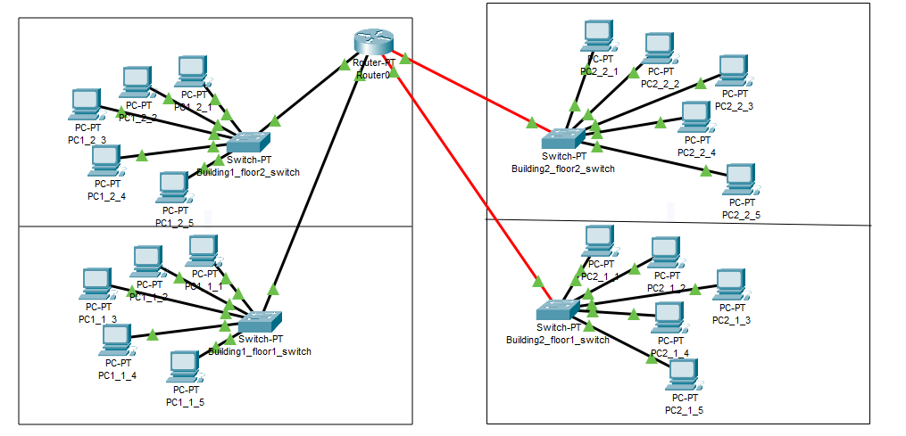
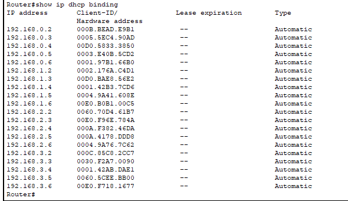
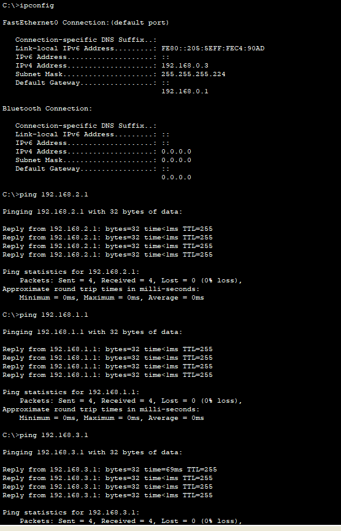
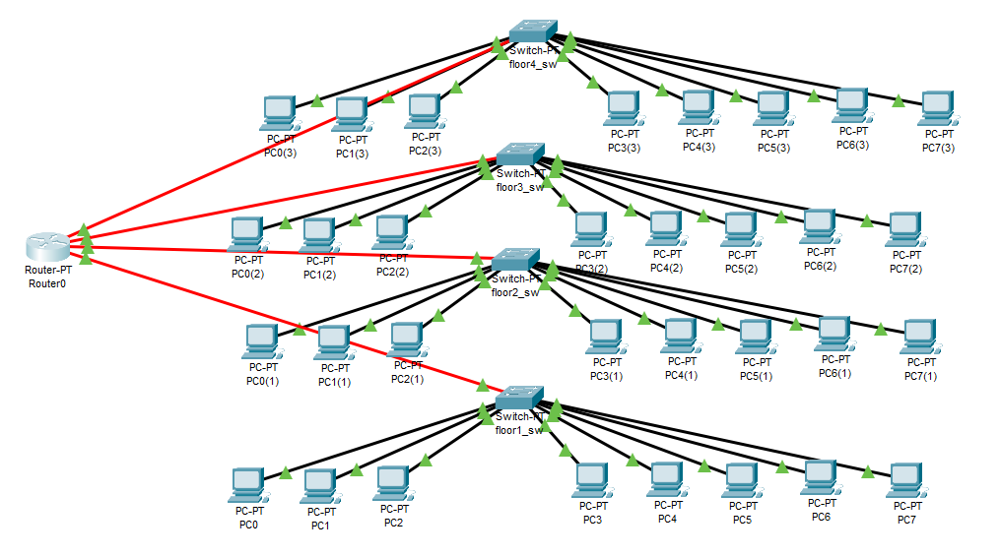
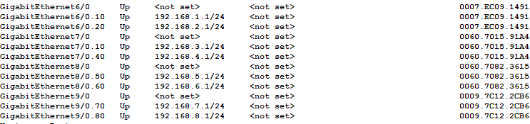
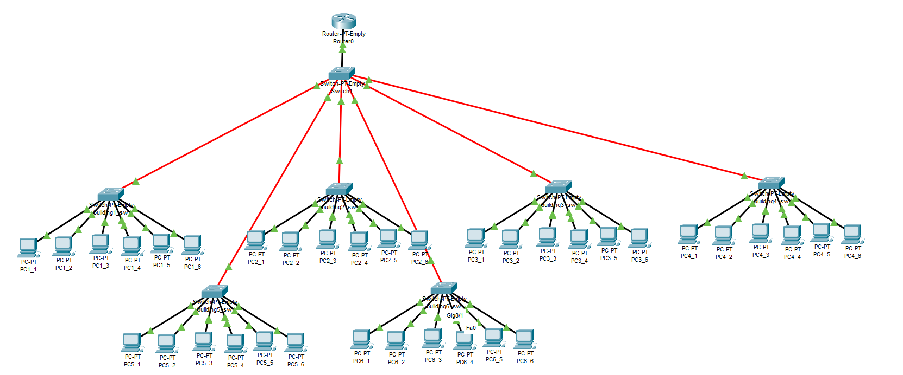

# Networking fundamentals, task 4.2

### Building a corporate network, two 2-floor buildings with 5 PCs on each floor

The topology of this network is rather simple: PCs on each floor in both buildings are connected to the switch located on the same floor using copper wire connection; the swithes are then connected to the router.
As the router is probably somewhere within organization, let's assume it's located in Building 1 on the second floor. The switches located in the same building are connected to the router using copper wire; switches from the other building are connected by fiber.



The router runs a DHCP server, assigning addresses to the client PCs from the following subnets:
Building 1 Floor 1 - 192.168.0.0/27

Building 1 Floor 2 - 192.168.1.0/27

Building 2 Floor 1 - 192.168.2.0/27

Building 2 Floor 2 - 192.168.3.0/27



The client devices can talk to each other within their respective subnets, and with devices from other subnets:



This could be restricted by firewall rules, or ACL, should the need arise.

The respective Packet Tracer file is 2buildings.pkt.

### Building a corporate network, one 4-floor building with two workgroups (3 and 5 PCs each) on every floor

The PCs on each floor are connected to a floor switch, that separates workgroups using VLANs; 4 floor switches are then connected to a router.
VLAN tags used are as follows:

vlan 10 - Floor 1 group1; address space 192.168.1.0/24

vlan 20 - Floor 1 group2; address space 192.168.2.0/24

vlan 30 - Floor 2 group1; address space 192.168.3.0/24

vlan 40 - Floor 2 group2; address space 192.168.4.0/24

vlan 50 - Floor 3 group1; address space 192.168.5.0/24

vlan 60 - Floor 3 group2; address space 192.168.6.0/24

vlan 70 - Floor 4 group1; address space 192.168.7.0/24

vlan 80 - Floor 4 group2; address space 192.168.8.0/24

The topology:



I've configured router subinterfaces to serve DHCP on respective VLANs:

```sh
!
interface GigabitEthernet6/0
 no ip address
!
interface GigabitEthernet6/0.10
 encapsulation dot1Q 10
 ip address 192.168.1.1 255.255.255.0
!
interface GigabitEthernet6/0.20
 encapsulation dot1Q 20
 ip address 192.168.2.1 255.255.255.0
!
interface GigabitEthernet7/0
 no ip address
!
interface GigabitEthernet7/0.10
 encapsulation dot1Q 30
 ip address 192.168.3.1 255.255.255.0
!
interface GigabitEthernet7/0.40
 encapsulation dot1Q 40
 ip address 192.168.4.1 255.255.255.0
!
interface GigabitEthernet8/0
 no ip address
!
interface GigabitEthernet8/0.50
 encapsulation dot1Q 50
 ip address 192.168.5.1 255.255.255.0
!
interface GigabitEthernet8/0.60
 encapsulation dot1Q 60
 ip address 192.168.6.1 255.255.255.0
!
interface GigabitEthernet9/0
 no ip address
!
interface GigabitEthernet9/0.70
 encapsulation dot1Q 70
 ip address 192.168.7.1 255.255.255.0
!
interface GigabitEthernet9/0.80
 encapsulation dot1Q 80
 ip address 192.168.8.1 255.255.255.0
!
```



Setting up DHCP:

```sh
!
ip dhcp excluded-address 192.168.1.1
ip dhcp excluded-address 192.168.2.1
ip dhcp excluded-address 192.168.3.1
ip dhcp excluded-address 192.168.4.1
ip dhcp excluded-address 192.168.5.1
ip dhcp excluded-address 192.168.6.1
ip dhcp excluded-address 192.168.7.1
ip dhcp excluded-address 192.168.8.1
!
ip dhcp pool floor1
 network 192.168.1.0 255.255.255.0
 default-router 192.168.1.1
ip dhcp pool floor1_1
 network 192.168.2.0 255.255.255.0
 default-router 192.168.2.1
ip dhcp pool floor2_1
 network 192.168.3.0 255.255.255.0
 default-router 192.168.3.1
ip dhcp pool floor2_2
 network 192.168.4.0 255.255.255.0
 default-router 192.168.4.1
ip dhcp pool floor3_1
 network 192.168.5.0 255.255.255.0
 default-router 192.168.5.1
ip dhcp pool floor3_2
 network 192.168.6.0 255.255.255.0
 default-router 192.168.6.1
ip dhcp pool floor4_1
 network 192.168.7.0 255.255.255.0
 default-router 192.168.7.1
ip dhcp pool floor4_2
 network 192.168.8.0 255.255.255.0
 default-router 192.168.8.1
!
```

The client devices can talk to each other within their respective subnets, and with devices from other subnets.

The respective Packet Tracer file is 4floors.pkt.

### Building a corporate network, five single-floor buildings with one workgroup in every building, and 1-port router

The topology:
We place a switch in every building, connecting PCs to the switch. Building switches are then connected to the backbone switch, which in turn is connected to the router's single port.



To route traffic from different subnets, and to serve DHCP, we use VLANs, and assign subinterfaces to the rouster's single port:

```sh
!
interface GigabitEthernet9/0
 no ip address
 duplex auto
 speed auto
!
interface GigabitEthernet9/0.10
 encapsulation dot1Q 10
 ip address 192.168.1.1 255.255.255.224
!
interface GigabitEthernet9/0.20
 encapsulation dot1Q 20
 ip address 192.168.2.1 255.255.255.224
!
interface GigabitEthernet9/0.30
 encapsulation dot1Q 30
 ip address 192.168.3.1 255.255.255.224
!
interface GigabitEthernet9/0.40
 encapsulation dot1Q 40
 ip address 192.168.4.1 255.255.255.224
!
interface GigabitEthernet9/0.50
 encapsulation dot1Q 50
 ip address 192.168.5.1 255.255.255.224
!
interface GigabitEthernet9/0.60
 encapsulation dot1Q 60
 ip address 192.168.6.1 255.255.255.224
!
```

The networks go as follows:

Building 1 - vlan 10; address space 192.168.1.0/27

Building 2 - vlan 20; address space 192.168.2.0/27

Building 3 - vlan 30; address space 192.168.3.0/27

Building 4 - vlan 40; address space 192.168.4.0/27

Building 5 - vlan 50; address space 192.168.5.0/27

Building 6 - vlan 10; address space 192.168.6.0/27

The DHCP is configured respectively:

```sh
!
ip dhcp excluded-address 192.168.1.1
ip dhcp excluded-address 192.168.2.1
ip dhcp excluded-address 192.168.3.1
ip dhcp excluded-address 192.168.4.1
ip dhcp excluded-address 192.168.5.1
ip dhcp excluded-address 192.168.6.1
!
ip dhcp pool building1
 network 192.168.1.0 255.255.255.224
 default-router 192.168.1.1
ip dhcp pool building2
 network 192.168.2.0 255.255.255.224
 default-router 192.168.2.1
ip dhcp pool building3
 network 192.168.3.0 255.255.255.224
 default-router 192.168.3.1
ip dhcp pool building4
 network 192.168.4.0 255.255.255.224
 default-router 192.168.4.1
ip dhcp pool building5
 network 192.168.5.0 255.255.255.224
 default-router 192.168.5.1
ip dhcp pool building6
 network 192.168.6.0 255.255.255.224
 default-router 192.168.6.1
!
```

The client devices can talk to each other within their respective subnets, and with devices from other subnets.
The respective Packet Tracer file is 5buildings.pkt.


