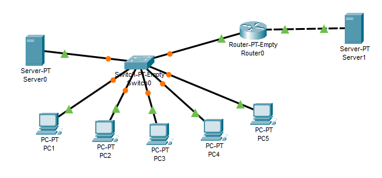

# Networking Fundamentals. Task 4.3

Building network topology from 5 PCs, 2 servers, switch, and router as per assignement:



The PCs and 1 server are assigned static addresses in 192.168.0.0/24 address space:

PC1 192.168.0.1

PC2 192.168.0.2

PC3 192.168.0.3

PC4 192.168.0.4

PC5 192.168.0.5

Server0 192.168.0.6

The second server is in 192.168.1.1/24 address space:

Server1 192.168.1.1

Router configuration:


```sh
Router(config)#interface GigabitEthernet8/0
Router(config-if)#ip address 192.168.0.100 255.255.255.0
Router(config-if)#exit
Router(config)#interface GigabitEthernet9/0
Router(config-if)#ip address 192.168.1.100 255.255.255.0
Router(config-if)#exit
Router(config)#enable secret 12345
Router(config)#exit
copy running-config startup-config
Destination filename [startup-config]?
Building configuration...
[OK]
```

Adding RIP routing:


Testing the connection:


As we can see, the packets are routed between networks. End devices can talk to each other both within their broadcast domain, and within RIP announced networks.
The Packet Tracer file is 4.3.pkt.

