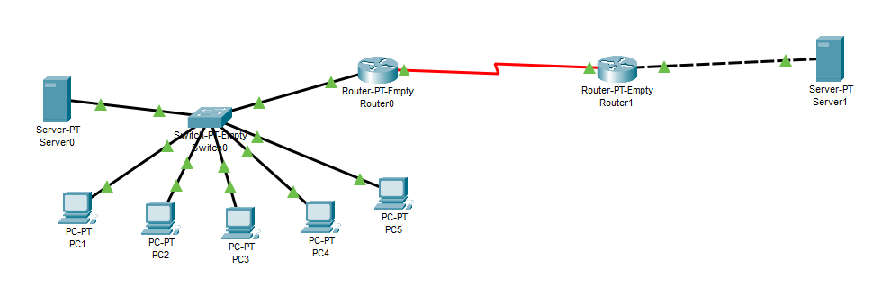
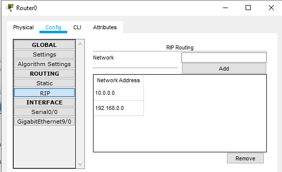
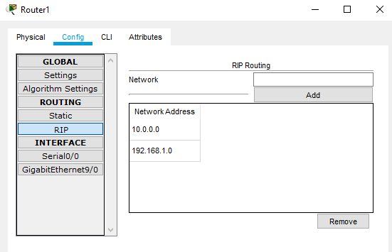
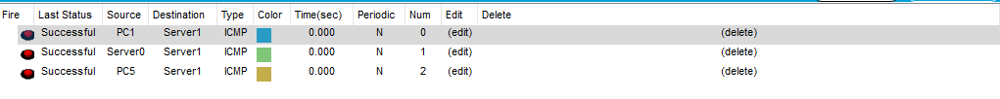
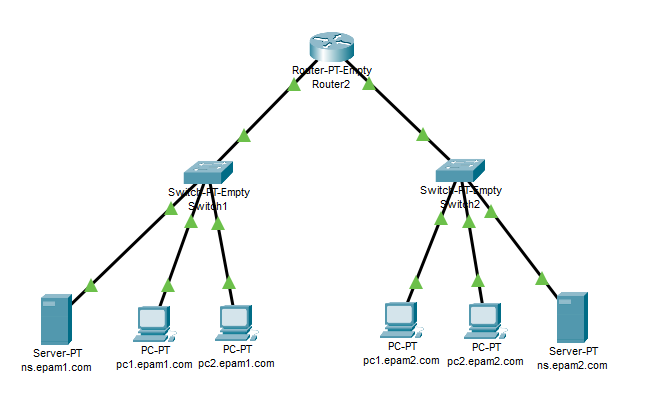
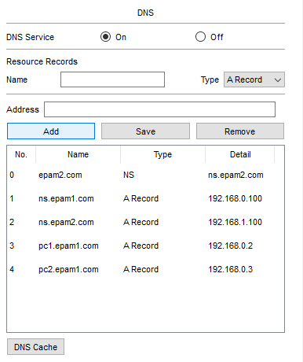
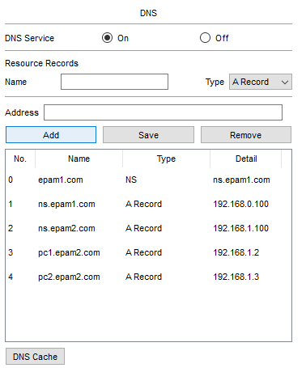

# Networking Fundamentals. Task 4.4

### Part 1

We take network from task 4.3, and add a router as per assignment:

Router0 is a gateway for 192.168.0.0/24, Router1 is a gateway to 192.168.1.0/24, and both routers have interconnected interfaces in 10.0.0.0/8 network.

Configuring RIP routing between networks for Router0 and Router1 respectively:

The devices from different networks can successfully communicate:

The respective Packet Tracer file is 4.4.1.pkt

### Part 2

Building the network, including 2 subnets, and 2 DNS zones: 192.168.0.0/24 for epam1.com, and 192.168.1.0/24 for epam2.com.
Two DNS servers serve the respective zones, and the router *gw* provides the L3 cummunication between networks.

Adding A and NS records to DNS servers, so we can communicate with PCs by their FQDN:

epam1.com DNS server:

epam2.com DNS server:

The PCs can communicate with the hosts in their zone by querying DNS server for A records stored directly on the server, and with hosts from other zone by querying DNS server for A records stored on another server, that can be queried due to the respective NS record.

Using pc1.epam1.com to reach hosts that belong to epam1.com and epam2.com:

![ICMP2](./images/success2.png "Success"

As we can see, the host can reach the hosts in both zones by their FQDN.

The respective Packet Tracer file is 4.4.2.pkt

