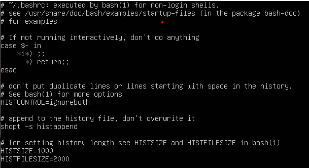
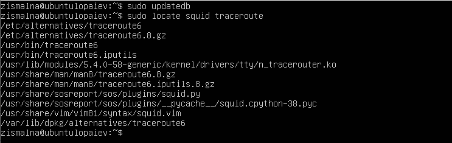

# Linux Essentials. Task 1

### Part 1

1,2) Logging as root and changing password:


The *passwd* utility is used to manage and change user passwords, and can display account status information when used with *-S* flag. User can change their own password, and passwods of other accounts when granted superuser privileges.
The files that passwd uses and subsequently changes are */etc/shadow* *etc/passwd* and */etc/pam.d/passwd*.

3) */etc/passwd* contains user account information.


Each line displays username, presense of password, UID, GID, UID info, home directory, and command/shell for each user respectively.

*w* displays users presense in the system, and the command they recently ran. For the purpose of getting a more apparent output, I also logged in as a different user.


It also displays in the top line how long the system has been up and provides load averages that indicate how busy the system is.

4) Changing personal info:


5) *man* and *info* provide information about binaries, their usage, files involved, etc.
using *man* for *passwd* and *man*, we can find information about the follwing keys, for instance:

*passwd -S* displays account status information 

*man -k* searches manpages for specific keywods, keyword "editor", for example


6) As per its manpage, *more* is a filter for paging through text one screenful at a time. *less* is a better *more*.
Example of using filter on .bashrc file:



7) The *finger* utility displays, among other information, user plans, written in ~/.plan file. After creating and modifying it, the output reads:


8) The files and directories in *home* can be listed with *ls*, adding *-a* to view hidden files:


### Part 1

1) The *tree* command can use patterns to highlight specific files in a filetree using a pattern:

```sh
cd /
tree -P "*c*"
```
Listing subdirectories of the root directory up to and including the second nesting level:
```sh
tree / -L 2
```

2) The file can be examined to determine its type using file command:

```sh
file .bash_history
.bash_history: ASCII text

file /sbin/init
/sbin/init: symbolic link to /lib/systemd/systemd
```

3) The file system can be navigated by using *cd* in combination with relative and absolute paths. For example, I can move from */home* directory to */home/zismalna* simply by typing *cd zismalna*, or by using absolute path: *cd /home/zismalna*. I can return to my home folder by using *cd ~*.


4) *ls* lists files and directories, where *-l* also lists file permissions, the number of links, owner name, owner group, file size, time of last modification, and the file or directory name. *-a* displays hidden files.


*-h* shows the information in human-readable format, and -Z displays security information.

5) 

6) Making a file and creating hard and soft links:

```sh
cd ~
mkdir test
cp .bash_history test/labwork2
cd test
ln labwork2 hard
ln -s labwork2 soft
```

Hard link points to the same inode as the original file, while soft link points to the path */home/zismalna/test/labwork2*.
After changing data using symbolic link, the data displayed changes in all three files, since symbolic link redirects to original file, and hard link points to the same inode where the data is actually stored.

Renaming files and deleting original:

```sh
mv hard hard_lnk_labwork2
mv soft symb_lnk_labwork2
rm labwork2
```

After this, the data still can be read by *cat hard_lnk_labwork2*, but the soft link is not working, since it points to the path that no longer exists: */home/zismalna/test/labwork2*.

7) Using locate to find files containing *squid* or *traceroute* sequence. Since *locate* searches the database, use *updatedb* first.



8) Determining which partitions are mounted in the system, as well as the types of these partitions:


9) Counting the number of lines in .bash_history file that contain *ls*:

```sh
grep -c ls .bash_history 
37
```

10) Finding all files in the */etc* directory containing the host character sequence.

```sh
find /etc -iname "*host*"
```


11) Listing all objects in */etc* that contain the ss character sequence.

```sh
find /etc -iname "*host*"
```

Doing same with *grep*:

```sh
tree /etc | grep ss | less*
```

12) Screen-by-screen print of the contents of the /etc directory.

```sh
ls -la /etc | less*
```

13) In Unix-like operating systems, a device file or special file is an interface to a device driver that appears in a file system as if it were an ordinary file. 
The type of device can be determined by using long listing: *ls -l*, where the first character in permissions stands for: *c* - character *b* - block *p* - pipe *s* - socket.

14) The file type can be determined by *ls -l*, where the first character in permissions stands for: *-* - regular file; *d* - directory; *l* -symbolic link.

15) Listing the first 5 directory files that were recently accessed in the /etc directory:


