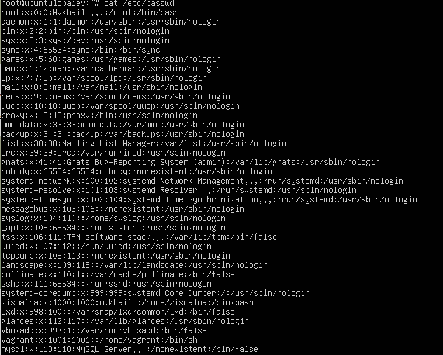
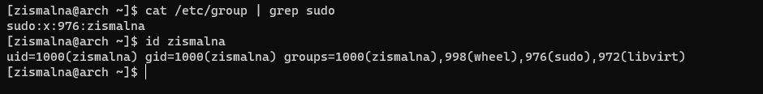
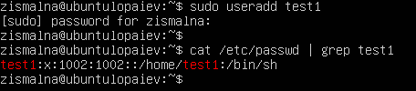
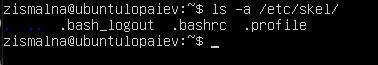
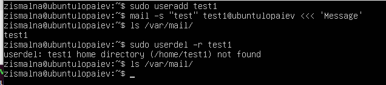
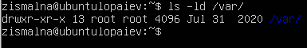
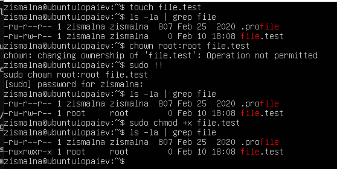
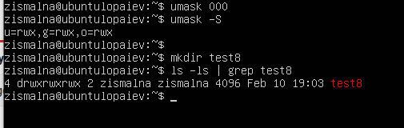

# Linux Essentials. Task 2

1) */etc/passwd* contains user account information.



Each line displays username, presense of password, UID, GID, UID info, home directory, and command/shell for each user respectively.

Pseudo-users: refers to users that normally have no defined shell, and are used by the system to define the owner of running background processes. Some of these pseudo-users include:
*bin* - legacy account; pretty much not used for anything; left in /etc/passwd for compatibility purposes;
*nobody* - In many Unix variants, "nobody" is the conventional name of a user account which owns no files, is in no privileged groups, and has no abilities except those which every other user has.
*sshd* - daemon for OpenSSH server; listens to incoming connections via SSH protocol.

2) UID is a simple numeric designation for an individual user. The uid range is 0-65535, where some identifiers are reserved for special use. These include 0 (root), 1-999(daemons, pseudo-users, system and reserved users), 1000+ (regular users).

3) GID is a unique identifier of the group within the system. This numeric value is used to refer to groups in the */etc/passwd* and */etc/group* files or their equivalents. Shadow password files and Network Information Service also refer to numeric GIDs.

4) */etc/group/* file shows present groups and group members. Applying *id* to user also displays groups the user belongs to.



5) Adding a user to the system can be performed by using *useradd* binary or *adduser* script. To add a user to the system with *useradd*, all that is required to specify is a username.



6) The login name can be changed by using *usermod -l newname oldname*. However, things like home folder of the group user belonged to remain unchanged; to completely rename all things associated with user we could do the following:

```sh
groupadd test2
usermod -d /home/test2 -m -g test2 -l test2 test1
```

This renames user *test1* to *test2*, including home folder and group.

7) The */etc/skel* folder contains files that will be copied to user home folder when creating one. By default, it contains the following:



8) The *userdel* with *-r* option deletes user and associated files and directiories like user home folder and mail spool.



9) *usermod -L username* locks account, while *usermod -U username* unlocks it

10) *passwd -d [username]* clears user password, allowing to set it themselves.

11) *ls -ld* prints onformation about the directory in long listing format



The information displayed is:

- file type and permissions (drwxr-xr-x),
- number of (hard) links (13),
- owner name (root),
- owner group (root),
- file size in bytes (in tis case, since it's a directory, the inode points to a single data block, which is 4096 bytes)
- time of last modification (Jul 31 2020), and
- directory name (/var)

12) The symbolic notation of file permissions contains file type, and permissions for user, group, and others.

The first bit indicates the file type:
- "-" - regularfile;
- "d" - directory;
- "b" - block device;
- "c" - character device;
- "l" - symbolic link;
- "p" - pipe;
- "s" - socket.

The following triplet indicates read, write, and execute permissions for user.

The next triplet indicates read, write, and execute permissions for group.

The final triplet indicates read, write, and execute permissions for other accounts.

Each of the three permission triads can be made up of the following characters: 

<table>
<tbody><tr>
<th scope="col" style="width: 10%;">
</th>
<th scope="col" style="width: 10%;">Character
</th>
<th scope="col" style="width: 30%;">Effect on files
</th>
<th scope="col" style="width: 50%;">Effect on directories
</th></tr>
<tr>
<th rowspan="2" style="text-align:left;">Read permission (first character)
</th>
<td>-
</td>
<td>The file cannot be read.
</td>
<td>The directory's contents cannot be shown.
</td></tr>
<tr>
<td>r
</td>
<td>The file can be read.
</td>
<td>The directory's contents can be shown.
</td></tr>
<tr>
<th rowspan="2" style="text-align:left;">Write permission (second character)
</th>
<td>-
</td>
<td>The file cannot be modified.
</td>
<td>The directory's contents cannot be modified.
</td></tr>
<tr>
<td>w
</td>
<td>The file can be modified.
</td>
<td>The directory's contents can be modified (create new files or folders; rename or delete existing files or folders); requires the execute permission to be also set, otherwise this permission has no effect.
</td></tr>
<tr>
<th rowspan="6" style="text-align:left;">Execute permission (third character)
</th>
<td>-
</td>
<td>The file cannot be executed.
</td>
<td>The directory cannot be accessed with *cd*.
</td></tr>
<tr>
<td>x
</td>
<td>The file can be executed.
</td>
<td>The directory can be accessed with *cd*; this is the only permission bit that in practice can be considered to be "inherited" from the ancestor directories, in fact if <i>any</i> folder in the path does not have the *x* bit set, the final file or folder cannot be accessed either, regardless of its permissions.
</td></tr>
<tr>
<td>s
</td>
<td colspan="2">The <b>setuid</b> bit when found in the <b>u</b>ser triad; the <b>setgid</b> bit when found in the <b>g</b>roup triad; it is not found in the <b>o</b>thers triad; it also implies that *x* is set.
</td></tr>
<tr>
<td>S
</td>
<td colspan="2">Same as *s*, but *x* is not set; rare on regular files, and useless on folders.
</td></tr>
<tr>
<td>t
</td>
<td colspan="2">The sticky bit; it can only be found in the <b>o</b>thers triad; it also implies that *x* is set.
</td></tr>
<tr>
<td>T
</td>
<td colspan="2">Same as *t*, but *x* is not set; rare on regular files, and useless on folders.
</td></tr></tbody></table>

13) The relationship between the file and the user who started the process,is determined as follows:

If the UID of the file is the same as the UID of the process,the user is the owner of the file.
If the GID of the file matches the GID of any group the user belongs to, he is a member of the group to which the file belongs.
If neither the UID, nor the GID of a file overlaps with the UID of the process and the list of groups that the user running it belongs to, then the user falls under "other" category.

14) *chown* and *chmod* change owner/group of the file, and file access mode respectively.



Here, first we create file *file.test*, then change its owner and its group to *root*. We can also use *chgrp* to change group. After that, we use *chmod* to give execution permissions.

15) Another method for representing Unix permissions is an octal (base-8) notation. This notation consists of at least three digits. Each of the three rightmost digits represents a different component of the permissions: owner, group, and others. (If a fourth digit is present, the leftmost (high-order) digit addresses three additional attributes, the setuid bit, the setgid bit and the sticky bit.)

Each of these digits is the sum of its component bits in the binary numeral system. As a result, specific bits add to the sum as it is represented by a numeral:

-  The read bit adds 4 to its total (in binary 100),
-  The write bit adds 2 to its total (in binary 010), and
-  The execute bit adds 1 to its total (in binary 001).

For example, *0644* in octal is equal to *-rw-r--r--*.

The default creation permissions for files are *666*, and *777* for directories. The *umask* value contains the permission bits that will NOT be set on the newly created files and directories.
By default, *umask* is set to 022, so files are created with *644* octal permissions, and directories with *755* octal permissions.
Changing *umask* value to 000 to test:



16) *SUID*, *SGID* perform permissions substitution when executing file. A file with *SUID* always executes as the user who owns the file, regardless of the user passing the command. *SGID*, if set on a file, allows the file to be executed as the group that owns the file (similar to *SUID*). If set on a directory, any files created in the directory will have their group ownership set to that of the directory owner.
For example, *SGID* special permission is set to such files as */var/log/journal* and */usr/bin/crontab*, and *SUID* is set to */usr/bin/su* and */usr/bin/passwd*. The last special permission is the "sticky bit." This permission does not affect individual files. However, at the directory level, it restricts file deletion. Only the owner (and root) of a file can remove the file within that directory

17) The command script should be executable - use *chmod +x filename* for this.


