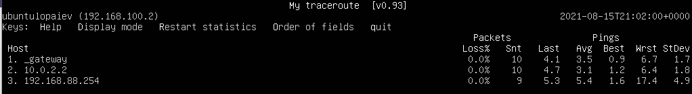
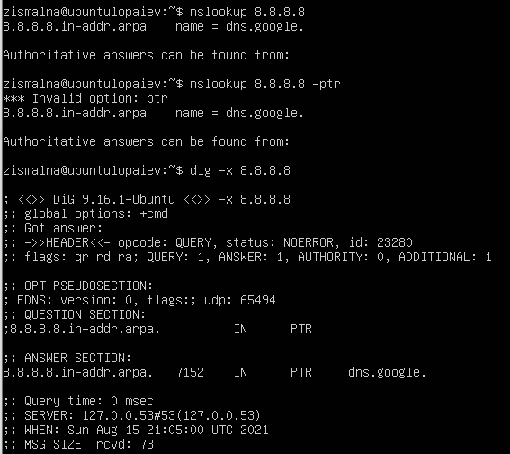
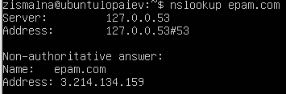
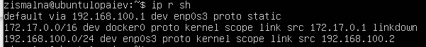
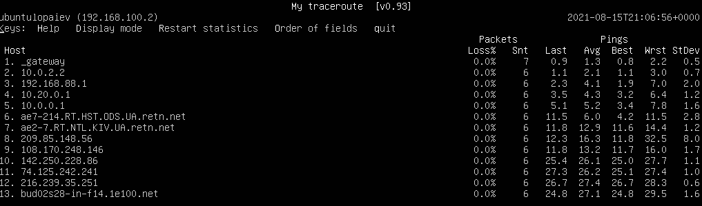

# Networking with Linux. Task 1

1) Created 2 VMs - VM1 and VM2. VM2 has one interface (internal), VM1 has 2 interfaces (NAT and internal).

2) Configuring networks:

Configuration for VM1 (using netplan):

```sh
# This is the network config written by 'subiquity'
network:
  ethernets:
    enp0s3:
      dhcp4: true
    enp0s8:
      dhcp4: false
      addresses: [192.168.100.1/24]
      nameservers:
        addresses: [8.8.8.8]
  version: 2
```

*enp0s3* is a NAT interface, and *enp0s8* is internal.

Configuring *iptables*:

```
sudo iptables -t nat -A POSTROUTING -s 192.168.100.0/24 ! -d 192.168.100.0/24 -j MASQUERADE
sudo iptables -P FORWARD ACCEPT
```

*net.ipv4.ip_forward* is set to 1.

Configuration for VM2 (using netplan):

```sh
# This is the network config written by 'subiquity'
network:
  ethernets:
    enp0s3:
      dhcp4: false
      addresses: [192.168.100.2/24]
	  gateway4: 192.168.100.1
      nameservers:
        addresses: [8.8.8.8]
  version: 2
```

3) Route from VM2 to host (host has an IP address of 192.168.88.254/24 gateway 192.168.88.1):



The packets pass via gateway 192.168.100.1, then forwarded to VM1 10.0.2.2, and then forwarded to VirtualBox host.

4) Internet access present, host *8.8.8.8* is reachable.

5) Using *nslookup* or *dig* to perform PTR lookup:



6) Querying DNS server to lookup *epam.com* IP address:



7) Viewing routing table for VM2:

```sh
ip r sh
```



8) Using *mtr* to trace route to *google.com*:




